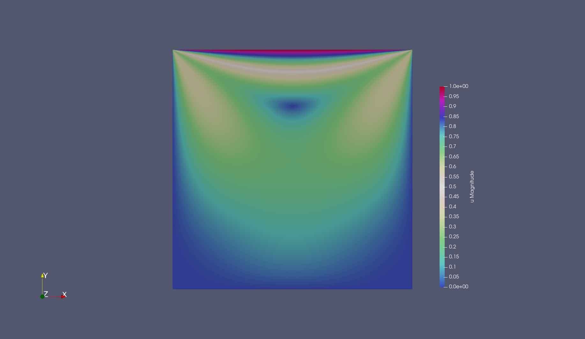

# Stokes solver


## Lid cavity problem:

The boundary conditions (for the velocity  field) for this problem are homogeneous Dirichlet on three edges, and ``(U_x,0)`` on the top face. 
As a block preconditioner I used ``(A,Bt; 0, -S)`` where ``S`` is the classical Schur complement. The implementation of the preconditioner has been done by using a block backsubstitution, by intepreting each matrix inverse as a linear operator, instead of the usual low level implementation. As a linear solver, FGMRES has been chosen. It performs automatically a right preconditioning, so the observed residual is the **true** one, not the one of the preconditioned system.


With 1 MPI process, here's the elapsed CPU time for the lid cavity problem

```
+---------------------------------------------+------------+------------+
| Total CPU time elapsed since start          |       194s |            |
|                                             |            |            |
| Section                         | no. calls |  CPU time  | % of total |
+---------------------------------+-----------+------------+------------+
| assemble_system                 |         8 |      75.5s |        39% |
| constructor                     |         1 |   0.00278s |         0% |
| estimate                        |         8 |        22s |        11% |
| initialize                      |         1 |   0.00335s |         0% |
| make_grid                       |         1 |    0.0142s |         0% |
| mark                            |         7 |    0.0136s |         0% |
| output_results                  |         8 |      8.19s |       4.2% |
| refine_grid                     |         7 |      1.45s |      0.74% |
| setup_system                    |         8 |      5.39s |       2.8% |
| solve                           |         8 |      81.6s |        42% |
+---------------------------------+-----------+------------+------------+
```

Running on 4 processors with `mpirun -np 4 ./stokes` the CPU time scales with a factor of roughly 3


```
+---------------------------------------------+------------+------------+
| Total CPU time elapsed since start          |      61.9s |            |
|                                             |            |            |
| Section                         | no. calls |  CPU time  | % of total |
+---------------------------------+-----------+------------+------------+
| assemble_system                 |         8 |      19.1s |        31% |
| constructor                     |         1 |    0.0027s |         0% |
| estimate                        |         8 |      6.58s |        11% |
| initialize                      |         1 |   0.00336s |         0% |
| make_grid                       |         1 |    0.0107s |         0% |
| mark                            |         7 |    0.0375s |         0% |
| output_results                  |         8 |      2.52s |       4.1% |
| refine_grid                     |         7 |      1.09s |       1.8% |
| setup_system                    |         8 |      2.14s |       3.5% |
| solve                           |         8 |      30.4s |        49% |
+---------------------------------+-----------+------------+------------+
```


Here the result after 7 grid refinements, showing the magnitude of the velocity vector.



# Navier stokes for incompressible viscous flow [Work in progress]

## Time dependent incompressible Navier Stokes with ARKODE

The goal of this is to march in time with an IMEX approach, using the SUNDIALS wrappers provided by the library, instead of hard-coding an implicit-explicit first order method. 
